# Wprowadzenie do sztucznej inteligencji

_Kamil Szczepanik_

<!-- _303782_ -->


## Dokumentacja

<details><summary>Ćwiczenie 1</summary>

### Ćw 1. (7 pkt), data oddania: do 18.10.2021 - Zagadnienie przeszukiwania i podstawowe podejścia do niego

Zaimplementować metodę gradientu prostego dla funkcji jednej zmiennej.
Zbadać działanie metody w zależności od parametrów wejściowych:
- punkt startowy
- współczynnika uczenia

Eksperymenty przeprowadzić dla funkcji z jednym minimum oraz dla funkcji z minimum lokalnym, czyli np.:

    f(x) = x^2 + 3x + 8
    f(x) = x^4 - 5x^2 - 3x


Nie trzeba implementować liczenia pochodnej z funkcji wejściowej - podajemy jako już znaną funkcję,

hint: f(x) i ∇f(x) najlepiej przekazać jako argument funkcji np.:

    # lambda x: x ** 2
    # lambda gx: 2 * gx


#### Rozwiązanie

Metoda gradientu prostego dla funkcji zmiennej pozwala znaleźć jej minumum lub maximum lokalne. Algorytm jest następujący:
1) Wybranie punktu startowego (x_k) oraz współczynnika uczenia
2) Policzenie wartości pochodnej funkcji w x_k czyli gradientu
3) Policzenie kolejnego punktu x ze wzoru: x_k+1 = x_k -+ wsp_ucz * d 
    
    gdzie: `d` to gradient. Do liczenia minimum (-), do liczenia maximum (+)

4) Powtarzamy punkty 2) i 3) do momentu aż otrzymamy punkt z zadowalającą dokładnością lub przekroczymy ustalony limit iteracji.

Algorytm dostosowuje wartość skoku kolejnej wartości `x`, w zależności od gradientu dla poprzedniego `x` i wartości współczynnika uczenia

W pliku `przeszukiwanie.py` znajduje się implementacja zadania. 

### Wykonane eksperymenty

###### Przyjęto parametry:
- Maksymalna liczba iteracji: 1000
- Zadowalająca dokładność: 0.0001

#### Dla funkcji f(x) = x^2 + 3x + 8 :
##### 1)
- punkt startowy = 0.5
- współczynnik uczenia = 0.1

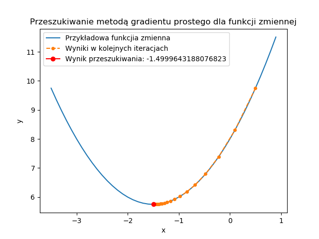

Wynik:  -1.4999643188076823,
Liczba iteracji:  49

##### 2)
- punkt startowy = 0.5
- współczynnik uczenia = 0.9

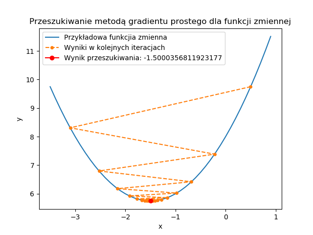

Wynik:  -1.5000356811923177,
Liczba iteracji:  49

#### Obserwacje
Dla funkcji kwadratowej algorytm działał prawidłowo. Wartości kolejnych x zbiegały do rozwiązania w obu przypadkach wielkości współczynnika uczenia.

#### Dla funkcji f(x) = x^4 - 5x^2 - 3x :
##### 1)
- punkt startowy = 0
- współczynnik uczenia = 0.1

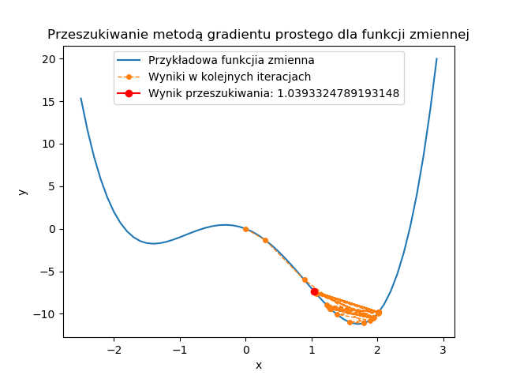

Wynik:  1.0393324789193148,
Liczba iteracji:  1000

##### 2)
- punkt startowy = 0
- współczynnik uczenia = 0.9

**OverflowError: (34, 'Numerical result out of range')**

Wartość pochodnej rośnie do nieskończoności - złe parametry

##### 3)
- punkt startowy = 0
- współczynnik uczenia = 0.2

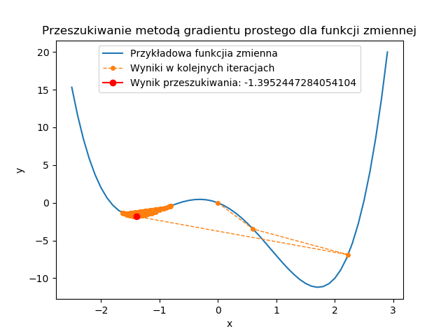

Wynik:  -1.4120028141545609,
Liczba iteracji:  1000

##### 4)
- punkt startowy = 0
- współczynnik uczenia = 0.01


Wynik:  1.7139370174658386,
Liczba iteracji:  63

##### 5)
- punkt startowy = 0
- współczynnik uczenia = 0.05


Wynik:  1.7139398323504043,
Liczba iteracji:  14

##### 6)
- punkt startowy = -0.5
- współczynnik uczenia = 0.1


Wynik:  -1.40177304570067,
Liczba iteracji:  12

##### 7)
- punkt startowy = -0.5
- współczynnik uczenia = 0.05


Wynik:  -1.4017700669801165,
Liczba iteracji:  17

#### Obserwacje
Dla eksperymentów 1), 2) i 3) algorytm nie zadziałał- minimum lokalne nie zostało osiągnięte. Jest to spowodowane zbyt dużą wartością współczynnika uczenia oraz samą charakterystyką wielomianu, ponieważ osiąga on bardzo różne wartości w stosunkowo niewielkim przedziale x. 
W eksperymentach 4) i 5) dobrano współczynnik uczenia taki, że minimum lokalne zostało osiągnięte. W eksperymencie 4) rozwiązanie zostało znalezione już po 14 iteracjach.
W eksperymentach 6) i 7) nieco przesunięto punkt startowy, co spowodowało znalezienie innego minima lokalnego.

#### Wnioski
Algorytm działa poprawnie dla dobrze dobranych parametrów. 

Należy dobrze wybrać punkt startowy oraz być świadomym, że w zależności od jego wartości algorytm znajduje inne rozwiązania (dla wielomianów o stopniu większym niż 2). Punkt startowy musi być także w takim miejscu, aby rozwiązanie nie zbiegało do +-nieskończoności (chyba, że damy wystarczająco mały współczynnik uczenia). 

Innym bardzo ważnym parametrem jest współczynnik uczenia. Dla funkcji większego stopnia współczynnik powinien być raczej mały (około 0.01-0.1). Można go oszacować na podstawie charakterystyki funkcji. Jeżeli występują w niej (nawet na oko) duże gradienty to lepiej dać ten współczynnik mały.

Chodzi o to, żeby iloczyn gradientu i współczynnika uczenia był na tyle mały aby nie spowodował niestabiloności w wyszukiwaniu. Jeżeli ten iloczyn będzie na tyle duży, że w następnym kroku algorytm znajdzie gradient większy od poprzedniego to możemy nie znaleźć optiumum lokalnego.

</details>


<details><summary>Ćwiczenie 2</summary>

## Algorytm ewolucyjny
Algorytm ewolucyjny dla problemu minimalizacji funkcji n-zmiennych. W algortmie zastosowano selekcję turniejową oraz sukcjesję elitarną.
Implementacje wykonano na podstawie pseudokodu przedstawionego na wykładzie:

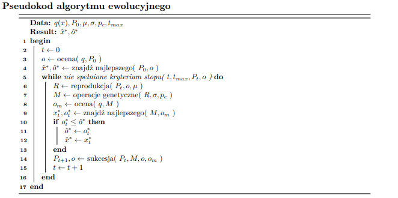

Parametrami pragramu są:
- Liczba iteracji
- Wielkość populacji inicjalnej
- Rozmiar turnieju
- Rozmiar elity
- Siła mutacji
- Prawdopodobieństwo mutacji
- Funkcja celu - jako minimalizacje pewnej funkcji

### Eksperymenty:
Funkcja, na której testowano algorytm to Bird Function

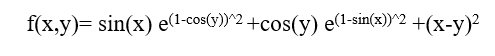

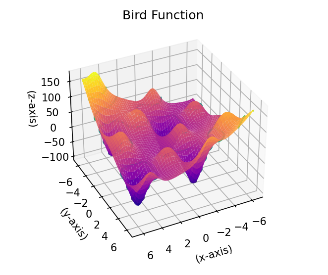

Jest  to dobra funkcja na testowanie przeszukujących algorytmów, ponieważ ma kilka minimów, w tym dwa optima globalne:
f(x)=−106.764537 ulokowane w x=(4.70104 ,3.15294) oraz x=(−1.58214 ,−3.13024)


#### Zależność wartości funkcji celu od wielkości populacji:
Parametry funkcji
- pop_arg_num = 2
- tournament_size = 2
- elite = 1
- sigma = 0.1
- mutation_prob = 0.5
- function_to_minimize = bird_function

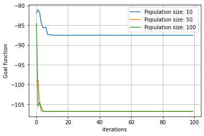

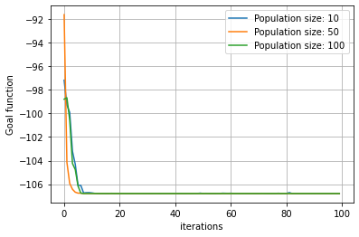

Na powyższych wykresach widać, że funcja celu maleje dla każdej wielkości populacji. Dodatkowo robi to całkiem szybko bo już po kilku iteracjach algorytm znajduje przybliżone rozwiązanie. Widać jednak, że populacja wielkości 10 może czasem nie wystarczyć na znalezienie rozwiązania - algorytm
utyka w minimum lokalnym i pozostaje tam do końca trwania programu.

#### Zależność wartości funkcji celu od siły mutacji (sigma):
Parametry:
- pop_size = 50
- pop_arg_num = 2
- tournament_size = 2
- elite = 1
- mutation_prob = 0.5
- function_to_minimize = bird_function


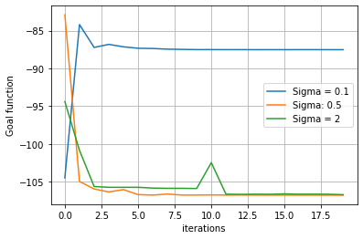


Sigma = 0.1 - W większości eksperymentów taka sigma była wystarczająca. Algorytm zbiega do rozwiązania. Czasami jednak dla tej wartości siły 
mutacji algorytm utyka w jednym z minimów lokalnych i nie udaje mu się stamtąd wydostać.

Sigma = 0.5 - Wydaje się być optymalną wartością siły mutacji. W jednym z eksperymentów bardzo dobre rozwiązanie zostało znalezione już w drugiej iteracji.

Sigma = 2 - Na pierwszej ilustracji można zauważyć, że algorymt dla sigmy = 2 jest mocno niestabilny i "skacze" po przeszukiwanej przestrzeni.
W końcu jednak znajduje minimum globalne. W innych przypadkach funkcja celu dla takie siły mutacji również szybko znajduje dobre rozwiazanie. Duża wartość sigmy zapobiega nadmiernej eksploatacji i pozwala na lepszą eksplorację.

#### Zależność wartości funkcji celu od rozmiaru elity:
Parametry:
- t_max = 20
- pop_size = 100
- pop_arg_num = 2
- tournament_size = 2
- elite = 1
- sigma = 0.1
- mutation_prob = 0.5

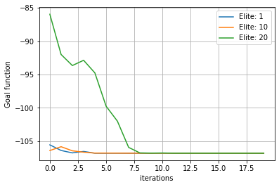

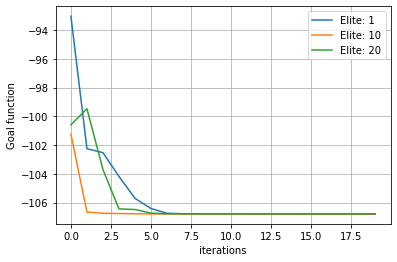

Sukcjesja elitarna jest dobrą metodą na pozostawienie dobrych osobników z poprzedniej iteracji. Na wykresach widać, że mała elita jest wystarczajaco dobra. Elita = 10 wypada jednak tak samo dobrze jeśli nie lepiej. Dla dużej wielkości elity, czasem algorytm znajdzie minimum lokalne i będzie się niego przez pewnien czas trzymał, tzn. nawet jeśli będzie znajdywał pojedyńcze lepsze osobniki to przez kolejne iteracje w elicie wciąż będą osobniki z minimum lokalnego, które będą hamowały znalzienie rozwiązania. Taką sytuację przedstawia pierwsza ilustacja.


##### 1) Animacja znajdywania rozwiązania w kolejnych pokoleniach:
Parametry:
- t_max = 10
- pop_size = 20
- pop_arg_num = 2
- tournament_size = 2
- elite = 1
- sigma = 0.1
- mutation_prob = 0.5
- function_to_minimize = bird_function

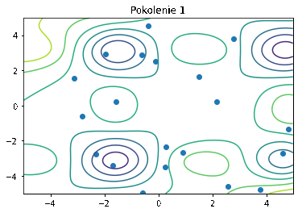


##### 2) Animacja znajdywania rozwiązania w kolejnych pokoleniach:
Parametry:
- t_max = 10
- pop_size = 50
- pop_arg_num = 2
- tournament_size = 4
- elite = 10
- sigma = 0.1
- mutation_prob = 0.1
- function_to_minimize = bird_function

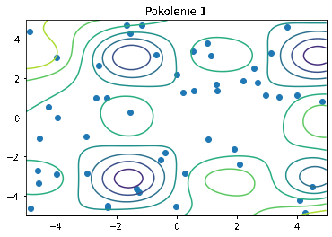

W tym doświadczeniu algorytm pozostał nieco dłużej w minimum lokalnym. Jest tak za sprawą dużego rozmiaru elity, który zmniejsza eksploracje w poszukiwaniu lepszego rozwiązania. Małe prawdopodobieństwo oraz siła mutacji (sigma) również sprawiają, że różnorodność osobników nie jest duża, co spowalnia znalezienie optimum globalnego.


#### Populacja początkowa: losowa i klony:

Doświadczenie 1)

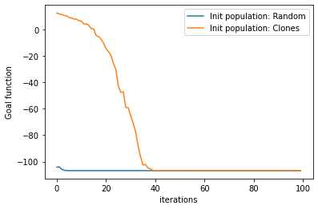

Doświadczenie 2)

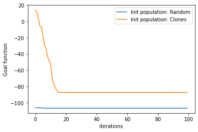

Na pierwszej ilustracji widać, że algorytm z początkową populacją złożoną z takich samych osobników działa o wiele wolniej niż z osobnikami losowymi. Z kolei w drugim doświadczeniu algorytm z klonami zatrzymał się w minimum lokalnym, prawdopodobnie dlatego, że populacja początkowa znajdowała się blisko tego minimim lokalnego.

##### Animacja znajdywania rozwiązania z populacją początkową z klonami
Pokolenia: 1, 5, 10, 15, 20, 25, 30, 35

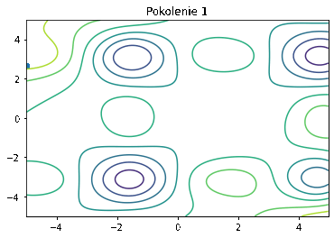

W powyższym przypadku algorytm nie zatrzymuje się w minimum lokalnym i znajduje optimum globalne.

### Podsumowanie
Algorytm ewolucyjny daje różne wyniki w zależności od wybranych parametrów oraz z samej losowości tego algorytmu. Parametry takie jak siła mutacji (sigma), prawdopodobieństwo mutacji, rozmiar turnieju, rozmiar elity wpływają na to czy algorytm ma charakter bardziej eksploracyjny czy eksploatacyjny. Dobrze gdy populacja jest odpowiednio duża, gdyż zwiększa to szansę na znalezienie optimum globalnego. Populacja początkowa złożona z różnorodnych osobników daje lepsze efekty pod względem rozwiązania i szybkości działania. Dla tych samych parametrów algorytm może znaleźć zupełnie różne rozwiązania - wynika to z wielu losowych kroków takich jak: inicjalizacja losowej populacji początkowej, losowy dobór uczestników turnieju, losowa mutacja osobników. Mimo tego, funkcja celu maleje w każdym przeprowadzonym doświadczeniu. Aby otrzymać optymalne rozwiązanie, najlepiej dla pewności włączyć algorytm kilka razy.


</details>

<details><summary>Ćwiczenie 3</summary>

## Dwuosobowe gry deterministyczne - gra w kółko i krzyżyk z użyciem algorytmu Minimax

Algorytm minimax jest metodą znajdywania optymalnego ruchu w deterministycznych grach dwuosobowych. Jej ideą jest minimalizowanie maksymalnych możliwych strat. Algorytm odnosi się do teorii gry o sumie zerowej, działając dla gier gdzie gracze wykonują ruchy naprzemiennie albo jednocześnie. Ważnym elementem algorytmu i tego jak działa jest to, że ruch zapewniający największą wypłatę jest wybierany przy założeniu, że przeciwnik gra optymalnie

Algorytm zaimplementowano na podstawie pseudokodu prezentowanego na wykładzie:

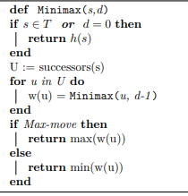

### Wykonane eksperymenty

 - Graczem max jest X

 - Graczem min jest O

W każdym eksperymencie wykonano 10 symulacji gier.

Zapisana została też ilość stanów przeszukana podczas algorytmu. Dla każdej rundy jest podana wartość, co oznacza, że liczby te dotyczą naprzemiennie gracza min i max.

### Gra pomiędzy dwoma AI minimax

##### 1. Parametry: depth_min = 1, depth_max = 1, zaczyna X

Wynik:

| Wygrane X | Wygrane O | Remisy |
| ------ | ------ | ------ |
| 0 | 0 | 10 |

Stany przeszukane w kolejnych rundach:

- 81, 64, 49, 36, 25, 16, 9, 4, 1

##### 2. Parametry: depth_min = 5, depth_max = 5, zaczyna X

Wynik:

| Wygrane X | Wygrane O | Remisy |
| ------ | ------ | ------ |
| 0 | 0 | 10 |

Stany przeszukane w kolejnych rundach:

- 73449, 23824, 5227, 1054, 257, 50, 15, 4, 1

#### Obserwacje i wnioski do eksperymentów 1 i 2:

Dla tych samych ustawień głębokości przeszukiwania zawsze wynikiem jest remis. Co więcej, ruchy graczy są zawsze takie same - czyli algorytm jest deterministyczny dla użytych parametrów. W każdej z 10 symulacji przebieg gry był taki sam. Można również zauważyć, że liczba przeszukanych stanów dla głębokości przeszukiwania 5 drastycznie wzrosła, w porównaniu do wielkości z eksperymentu 1.

Algorytm zakłada że przeciwnik gra optymalnie i wyszukuje optymalne rozwiązanie. Ponieważ przeciwnikiem jest ten sam algorytm o tych samych parametrach, obaj gracze grają optymalnie co wynikuje remisem.

##### 3. Parametry: depth_min = 1, depth_max = 5, zaczyna X

Wynik:

| Wygrane X | Wygrane O | Remisy |
| ------ | ------ | ------ |
| 0 | 0 | 10 |

Stany przeszukane w kolejnych rundach:

- 73449, 64, 5227, 36, 257, 16, 15, 4, 1

##### 4. Parametry: depth_min = 1, depth_max = 0, zaczyna X

Wynik:

| Wygrane X | Wygrane O | Remisy |
| ------ | ------ | ------ |
| 0 | 10 | 0 |

Stany przeszukane w kolejnych rundach:

- 9, 64, 7, 36, 5, 13

#### Obserwacje i wnioski do eksperymentów 3 i 4:

Dla różnych ustawień głębokości przeszukiwania algorytmy i tak wynikami są tylko remisy. Przeszukiwanie z głębią 1 wystarcza aby nie przegrać rozgrywki, algorytm i tak znajduje optymalne zagranie. Możliwe, że jest to spowodowane małą złożonością gry "Kółko i krzyżyk". Prawdopodbnie przykładowo dla szach byłaby tu różnica. Po zmniejszeniu głębokości przeszukiwania do 0, wygrywa zawsze O. Przy głębokości równej 0 algorytm nie przeszukuje możliwych zagrań tylko wybiera najlepsze zagranie na podstawie heurysyki. To jednak nie wystarcza aby obronić się przed minimax, który wybiera zagrania optymalne. Gry wyglądają za każdym razem tak samo - deterministyczność.


**W kolejnych eksperymentach liczba przeszukanych stanów odnosi się tylko do gracza używającego algorytmu**

##### 5. Parametry: Gracz max wybiera ruch losowo, depth_min = 1, zaczyna X

Wynik:

| Wygrane X | Wygrane O | Remisy |
| ------ | ------ | ------ |
| 0 | 9 | 1 |

Stany przeszukane w kolejnych rundach są rózne:
- 64, 36, 13
- 64, 36, 16, 3
- 64, 36, 13, 2

##### 6. Parametry: Gracz max wybiera ruch losowo, depth_min = 1, zaczyna O ( teraz zaczyna algorytm)

Wynik:

| Wygrane X | Wygrane O | Remisy |
| ------ | ------ | ------ |
| 0 | 7 | 3 |

Stany przeszukane w kolejnych rundach są rózne:
- 81, 49, 25, 7, 1
- 81, 49, 21, 9, 1
- 81, 49, 21, 7, 1
- 81, 49, 21, 5, 1
- 81, 49, 21
- ...

##### 7. Parametry: Gracz max wybiera ruch losowo, depth_min = 5, zaczyna O ( teraz zaczyna algorytm)

Wynik:

| Wygrane X | Wygrane O | Remisy |
| ------ | ------ | ------ |
| 0 | 10 | 0 |

Stany przeszukane w kolejnych rundach są rózne:
- 73449, 5227, 105
- 73449, 5227, 144, 7
- 73449, 5227, 149, 3
- 73449, 5335, 181, 6
- 73449, 5335, 161, 11
- ...


#### Obserwacje i wnioski do eksperymentów 5, 6 i 7:
W tych eksperymentach jeden z graczy losował ruch z dostępnych, a drugi korzystał z algorytmu minimax. Wydawałoby się, że minimax powinien sobie dobrze radzić, i rzeczywiście w większości wygrywa ale nie zawsze. Dla głębokości przeszukiwania depth=1, w sytuacji kiedy zaczyna gracz losowy remisów jest mniej niż kiedy zaczyna algorytm. Algorytm zakłada, że przeciwnik gra optymalnie, a losowe ruchy takie nie są, więc algorytm może nie działać - szczególnie dla małej głębokości przeszukiwania. Kiedy jednak ustalono, że depth=5 algortym nie miał problemów z pokonaniem gracza losowego. 
Warto zaznaczyć, że rozgrywki z tych eksperymentów nie były jednakowe. Przeciwnik nie gra optymalnie tylko losowo, zatem dla takich ustawień gra nie jest deterministyczna.

### Podsumowanie
Algorytm minimax jest prostą w implementacji i ciekawą metodą znajdywania optymalnych ruchów w deterministycznych grach dwuosobowych. W grze "Kółko i krzyżyk" głębokość przeszukiwania w rozgrywce między dwoma AI nie miała znaczenia, dopóki jedno z nich było równe 0 - wtedy oczywiście nie ma przeszukiwania tylko wybieranie heurystyczne i gra kończyła się wygraną algorytmu z większą głębokością. W takiej małej grze jak kółko i krzyżyk występuje zaskakująco dużo stanów, które algorytm może rozpatrzyć jeśli ma dużą wartość głębokości przeszukiwania.

Można wygrać z komputerem ale tylko wtedy kiedy gra on losowo - z algorytmem minimax się nie uda. Uważam, że gra w której wiemy, że przegramy lub zremisujemy raczej nie będzie sprawiać długo przyjemności - w grach chodzi o to aby wy**gry**wać

##### Niestey nie udało się zaimplementować przycinania alfa beta

</details>

<details><summary>Ćwiczenie 4</summary>

# Naiwny klasyfikator Bayesa (Gaussowski)

Naiwny klasyfikator Bayesa to prosty klasyfikator probabilistyczny. Jest to rodzina algortmów, których wspólną regułą jest wzajemna niezależność predyktorów ( zmiennych niezależnych ). Często nie mają one żandego związku z rzeczywistością i właśnie z tego powodu nazywa się je naiwnymi. Bardziej opisowe jest określenie - "model cech niezależnych". Naiwny klasyfikator Bayesa opiera się na twierdzeniu Bayesa.

Gaussowski naiwny klasyfikator Bayesa opiera się na założeniu, że dane związane z klasą są rozłożone zgodnie z rozkładem normalnym ( Gaussa ). prawdopodobieństwo jest liczone ze wzoru:

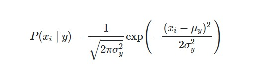


## Zadanie: 
Zaimplementować naiwny klasyfikator Bayesa (Gaussowski).
Do eksperymentów wykorzystać zbiór danych dot. jakości wina.
Do weryfikacji jakości modelu wykorzystać:
 - k-krotną walaidację krzyżową (k=5)
 - oraz podział na zbiór treningowy i testowy (60/40)

Do eksperymentów użyte zostały dane o winie czerwonym. Jest to zbiór danych wielkości około 1500 zapisów dotyczących właściwości wina. Klasami, do których dane były klasyfikowane była cecha jakości wina ( quality ). Klasyfikator miał na podstawie danych o winie przyporządkować mu jakość.


### Implementacja

W implementacji użyto bibliotekę `pandas`, służącą do manipulacji i analizy danych. Dzięki niej można łatwo wczytać dane i wydobyć z nich potrzebne informacje. Bibliotekę tą użyto w celu grupowania danych od klas, podstawowych obliczeń oraz liczenia średniej i odchylenia standardowego cech wina. W celu policzenia prawdopodobieństwa użyto biblioteki `scipy.stats`, której funkcja `norm.pdf()` oblicza prawdopodobieństwo według wyżej wymienionego wzoru.

W pliku [classifier.ipynb](task4-naive-bayes-classifier/classifier.ipynb) znajduje się implementacja klasyfikatora oraz przeprowadzone eksperymenty.

#### Miara oceny jakości klasyfikatora
Do oceny jakości klasyfikatora wybrano dokładność ( accuracy ), czyli stosunek liczby poprawnych predykcji do liczby danych testowych ( liczba danych, dla których predykcji była robiona). Jest do dobra metoda sprawdzania jakości modelu, ponieważ jest intuicyna, łatwa w implementacji oraz dostarcza wystarczającą ocenę.

### Eksperymenty
#### k-krotna walidacja krzyżowa
Dla k-krotnej walidacji krzyżowej należy przeprowadzić tylko jeden eksperyment, ponieważ dane są dzielone w zawsze taki sam sposób ( nie ma tasowania danych przed podziałem ).

Wynik:
```
    accuracy = 0.5253663793103448
```
#### Prosty podział na zbiór treningowy i testowy
Dla tej metody walidacji wykonano trzy eksperymenty i każdy z nich dał inny rezultat. Jest tak, ponieważ za każdym razem zbiór treningowy i testowy jest inny ( są losowane ), jednak ich stosunek jest taki sam i równy 60/40 (treningowy/testowy).

1) Wynik:
```
    accuracy =  0.4609375
```
2) Wynik:
```
    accuracy = 0.5640625
```
3) Wynik:
```
    accuracy = 0.5828125
```
Jak widać wyniki eksperymentów bardzo się różnią. Ciężko stwierdzić jaka jest dokładność modelu na prawdę.
### Wyniki

| k-krotna walidacja krzyżowa ( k = 5 ) | Prosty podział na zbiór treningowy i testowy |
| ------ | ------ |
| accuracy = 0.5253663793103448 | accuracy =  0.4609375 |
| - | accuracy = 0.5640625 |
| - | accuracy = 0.5828125 |


### Pytania:
##### Jakiego podzbioru danych (z tych którymi dysponujemy) użyjemy do zbudowania docelowego modelu na potrzeby klasyfikowania nowych próbek (czyli dla tych dla których budujemy klasyfikator)?

 - **Dla walidacji z prostym podziałem danych na zbiór treningowy i testowy**, do budowy docelowego modelu należy użyć **tylko zbiór treningowy**. Jest to konieczne, ponieważ walidację należy przeprowadzać na danych, które "nie widziały" danych treningowych. Chodzi o to, aby nie sprawdzać modelu na danych, na których model się uczyło. W ten sposób ominięty zostanie problem nadmiernego dopasowania ( overfitting ).

 - **Dla k-krotnej walidacji krzyżowej** dane, do budowy docelowego modelu używane są **wszystkie dane lecz "nie wszystkie na raz"**. Po podzieleniu danych na _k_ podzbiorów, zbiór treningowy to wszystkie podzbiory oprócz jednego, a zbiór testowy to ten jeden podzbiór, którego nie ma w zbiorze treningowym. Takich par zbiorów treningowych i testowych będzie _k_. Na każdej takiej parze model jest budowany i weryfikowany, co w rezultacie oznacza, że wszystkie dane zostaną użyte do zbudowania modelu.

##### Jak zinterpretować różnice/brak różnic w wynikach z weryfikacji jakości modelu obu metod (k-krotna walidacja vs zbiór treningowy i testowy)
 - Dużą różnicą tych metod weryfikacji modelu jest to, że w k-krotnej walidacji otrzymujemy jeden wynik, a w prostym podziale otrzymujemy inny wynik w każdym wywołaniu. Wnioskiem tego jest to, że dla prostego podziału nie możemy jednoznacznie stwierdzić jaka jest jakość modelu, a dla k-krotnej walidacji już tak i jest to bardziej miarodajna metoda.

</details>

<details><summary>Ćwiczenie 5</summary>

### Zespół:
**Piotr Hondra**

**Kamil Szczepanik 303782**

# Ćw 5. - Sztuczne sieci neuronowe

Zaimplementować sztuczną sieć neuronową z warstwą ukrytą.
Implementacja powinna być elastyczna na tyle, żeby można było zdefiniować liczbę neuronów wejściowych, ukrytych i wyjściowych.
Wykorzystać sigmoidalną funkcję aktywacji i do trenowania użyć wstecznej propagacji błędu z użyciem metody stochastycznego najszybszego spadku.
Sieć nauczyć rozpoznawać jakość wina jak w ćwiczeniu 4. i porównać wyniki z otrzymanymi poprzednio.
Na wykresie pokazać jak zmieniał się błąd uczonej sieci w kolejnych epokach.
Poeksperymentować ze współczynnikiem uczenia oraz liczbą epok.

## Implementacja

Zadanie zaimplementowano tworząc klasę sieci nueronowej oraz klasy warstw - fully connected i aktywacji. Dzięki temu możliwe jest łatwe dodawanie warstw oraz zmiana parametrów takich jak liczbe neuronów wejściowych, ukrytych i wyjściowych. W klasie warstwy zaimplementowana jest propagacja w przód i wsteczna. W klasie sieci neuronowej najważniejsza metodą jest `fit()`. Wywołuje ona uczenie sieci według podanych parametrów, takich jak liczba epok czy współczynnik uczenia. Aby poprawić jakość uczenia, zastosowano standaryzacje.

Implementacje zadania oraz eksperymenty znajdują się w pliku [neural_network.ipynb](neural_network.ipynb)

## Eksperymenty

**Wykresy przedstawiają jak zmieniał się błąd w uczonej sieci**

### 1. Liczba neuronów ukrytych = 50, liczba epok = 500 , współczynnik uczenia = 0.1

| test accuracy | train accuracy | error |
| ------------- | -------------- | ----- |
| 0.610938 | 0.839416 | 0.045849 |


### 2. Liczba neuronów ukrytych = 50, liczba epok = 500 , współczynnik uczenia = 0.4

| test accuracy | train accuracy | error |
| ------------- | -------------- | ----- |
| 0.603125 | 0.932221 | 0.017000 |


### 3. Liczba neuronów ukrytych = 50, liczba epok = 500, współczynnik uczenia = 0.05

| test accuracy | train accuracy | error |
| ------------- | -------------- | ----- |
| 0.604688 | 0.755996 | 0.063980 |


### 4. Liczba neuronów ukrytych = 50, liczba epok: 2000, współczynnik uczenia = 0.05

| test accuracy | train accuracy | error |
| ------------- | -------------- | ----- |
| 0.6046875 | 0.93534 | 0.021004 |


### 5. Liczba neuronów ukrytych = 100, liczba epok: 2000, współczynnik uczenia = 0.05

| test accuracy | train accuracy | error |
| ------------- | -------------- | ----- |
| 0.5828125 | 0.9457768508863399 | 0.016521 |


### 6. Liczba neuronów ukrytych = 1000, liczba epok: 2000, współczynnik uczenia = 0.05

| test accuracy | train accuracy | error |
| ------------- | -------------- | ----- |
| 0.571875 | 0.89676 | 0.018868 |


## Porównanie eksperymentów
| test_acc 	| train_acc 	| epochs 	| learning_rate 	| hidden_neurons 	|
|----------	|-----------	|--------	|---------------	|----------------	|
| 0.61     	| 0.84      	| 500    	| 0.1           	| 50             	|
| 0.60     	| 0.93      	| 500    	| 0.4           	| 50             	|
| 0.60     	| 0.76      	| 500    	| 0.05          	| 50             	|
| 0.60     	| 0.94      	| 2000   	| 0.05          	| 50             	|
| 0.58     	| 0.95      	| 2000   	| 0.05          	| 100            	|
| 0.57     	| 0.90      	| 2000   	| 0.05          	| 1000           	|

### Obserwacje
- Wraz ze zwiększaniem liczby epok, liczby neuronów w warstwie ukrytej wydłuża się czas uczenia.
- Zwiększanie liczby neuronów w warstwie ukrytej powoduje zwiększenie ilości stopni swobody modelu, przez co może lepiej dopasowywać się do danych trenujących
- Inicjalizacja wag tymi samymi liczbami skutkuje brakiem możliwości uczenia sieci.
- Dokładność na zbiorze testowym rośnie, a potem utrzumuje się lub spada.
- Po pewnej liczbie epok dokładność na zbiorze testowym rośnie, a potem utrzumuje się lub spada, a dokładność na zbiorze treningowy cały czas rośnie.
- Standaryzacja danych pozwala osiągnać dużo lepsze wyniki.

### Wnioski
- Perceptron wielowarstwowy z jedną warstwą ukrytą może aproksymować dowolnie nieliniową funkcję z dowolną dokładności, co skutkuje łatwością przeuczenia.
- Należy odpowiednio inicjalizować wagi.
- Zbyt dużu liczba epok prowadzi do przeuczenia, zbyt mała do niedouczenia.
- Zbyt duży krok uczenia prowadzi skutkuje brakiem zbieżności, natomiast zbyt mały znacząco wydłuża proces uczenia.
- Warto zastosować early stopping, gdy błąd na zbiorze walidacyjnym utrzymuje się przez określona liczbę epok, co poprawi czas uczenia i zmniejszy przeuczenie.


## Porównanie z naiwnym klasyfikatorem Bayesa

Porównanie wartości accuracy dwóch klasyfiktorów przedstawiono w tabeli. Wynik naiwnego klasyfikatora Bayesa jest rezultatem 5-krotnej walidacji krzyżowej. Wynik sieci neuronowej to najlepszy uzyskany wynik z powyższych eksperymentów.

| Naiwny klasyfikator Bayesa | Sieć neuronowa  |
| ------------- | -------------- |
| 0.5568 | 0.610938 |

Zgodnie z oczekiwaniami naiwny klasyfikator Bayesa osiąga gorszą dokładność od perceptronu wielowarstowego z jedna warstwą ukrytą. Uważamy, że wynika to m.in. z niespełnienia założeń klasyfikatora Bayesa (niezależność liniowa atrybutów/rokzład normalny atrybutów).


</details>


<details><summary>Ćwiczenie 6</summary>

# Ćwiczenie 6 - Uczenie się ze wzmocnieniem

Zaimplementować algorytm Q-Learning.
Zebrać i przedstawić na wykresie liczbę wykonanych kroków i naliczoną karę/nagrodę w kolejnych epokach.
Problem do rozwiązania to znalezienie drogi z punktu 'S' do punktu 'F' w "labiryncie" / świecie z przeszkodami.
Rezultatem działania algorytmu powinna być ścieżka w postaci: (1,1)->(0,1)->...->(2,3) oraz ww. wykres.

## Algorytm

Algorytm uczenia ze wzmocnieniem opiera się na symulowaniu kolejnych kroków, i w zależności czy jest on porządany czy nie przyznajemy agentowi nagrodę, bądź karę. W przypadku labiryntu nagroda jest przyznawana w momencie dojścia do celu a kara np. w momecie wejścia w ścianę. Następnie na podstawie tego jaka nagroda została przyznana po wykonaniu akcji w danym stanie, aktualizowana jest tabela Q. Ma ona wierszy tyle ile jest stanów w środowiku i kolumn tyle ile jest możliwych akcji. W niej zapisana jest "jakość" (quality) danej akcji w danym stanie. Dzięki temu algorytm "uczy się" na podstawie przeszłych doświadczeń. 

Tabela Q jest aktualizowana według poniższego wzoru:

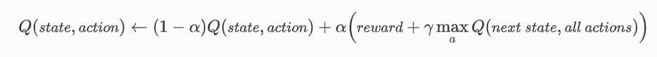

gdzie:

- alpha ( 0 < alpha < 1) to współczynnik uczenia - ustala jak bardzo wartości Q mają się zmieniać
- gamma ( 0 < gamma < 1) współczynnik zniżki - determinuje jak dużo wagi algorytm przywiązuje do przyszłych zniżek, tzn. czy koncentruje się na tym co już wie i w to idzie ( eksploatacja ) czy "zwiedza" przestrzeń stanów aby w przyszłości mieć jak największą nagrodę.

## Implementacja

W pliku [q-learning.ipynb](task6-reinforecement-q-learning/q-learning.ipynb)
znajduje się cała implementacja zadania. Stworzona tam klasa MazeEnv imlpementuje środowisko labiryntu, czyli opisuje stany, nagrody oraz
zawiera funkcję kroku z jednego miejsca na mapie do drugiego.

Do stowrzenia środowiska potrzebna jest mapa dostarczona jako lista z kolejnymi wierszami labiryntu.


# Eksperymenty

Parametry `alpha` i `gamma` udało się dobrać, tak że algorytm z powodzeniem uczy się drogi w labiryncie.

## 1) Mała mapa

Stworzono następującą mapę:

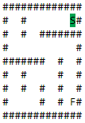

##### Parametry: `alpha = 0.1`, `gamma = 0.6`
##### Liczba epok: `1001`

### Wynik nauczonego agenta:

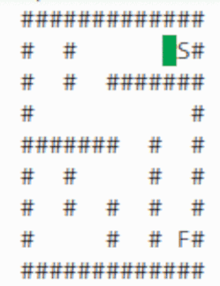

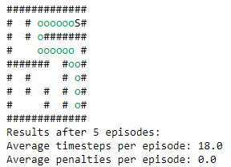


#### Wykresy liczby wykonanych kroków i naliczonej kary w kolejnych epokach podczas uczenia:

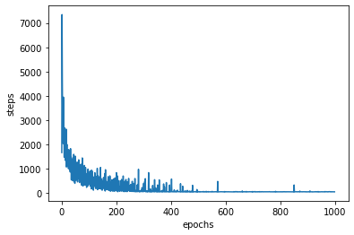

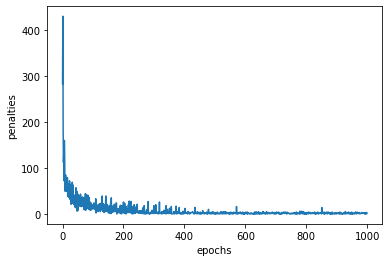

## 2) Duża mapa

Stworzono następującą mapę:

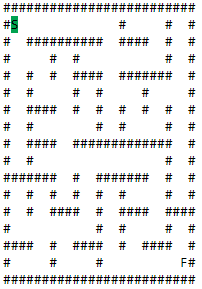

##### Parametry: `alpha = 0.1`, `gamma = 0.6`
##### Liczba epok: `1001`

### Wynik nauczonego agenta:

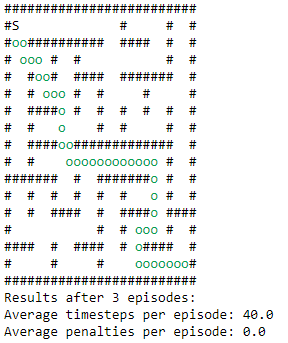


#### Wykresy liczby wykonanych kroków i naliczonej kary w kolejnych epokach podczas uczenia:

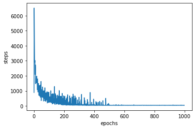


# Wnioski

Algorymt działa bardzo dobrze i szybko znajduje optymalną trasę w labiryncie. Praktycznie już przy 500 epoce algorytm już nie popełnia błedów. Nauczony agent bezbłednie przechodzi labirynt. 


</details>


<details><summary>Ćwiczenie 7</summary>

TODO

</details>
