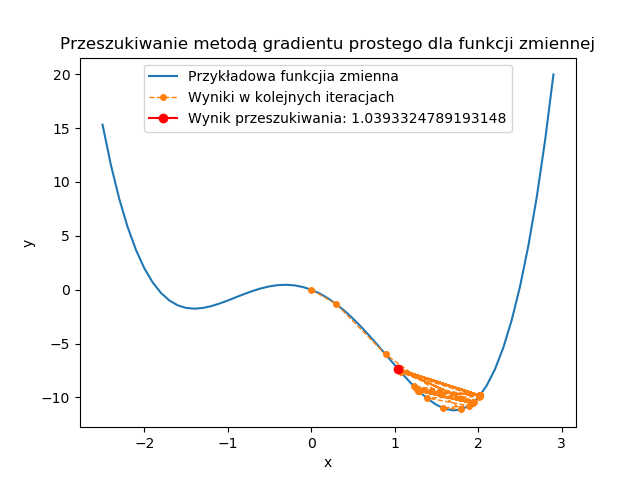
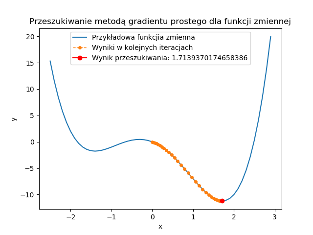
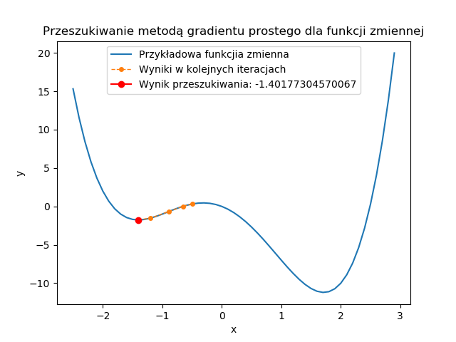

# Wprowadzenie do sztucznej inteligencji

_Kamil Szczepanik_

_303782_

## Dokumentacja

Ćwiczenie 1

### Ćw 1. (7 pkt), data oddania: do 18.10.2021 - Zagadnienie przeszukiwania i podstawowe podejścia do niego

Zaimplementować metodę gradientu prostego dla funkcji jednej zmiennej.
Zbadać działanie metody w zależności od parametrów wejściowych:
- punkt startowy
- współczynnika uczenia

Eksperymenty przeprowadzić dla funkcji z jednym minimum oraz dla funkcji z minimum lokalnym, czyli np.:

    f(x) = x^2 + 3x + 8
    f(x) = x^4 - 5x^2 - 3x

Nie trzeba implementować liczenia pochodnej z funkcji wejściowej - podajemy jako już znaną funkcję,

hint: f(x) i ∇f(x) najlepiej przekazać jako argument funkcji np.:

    # lambda x: x ** 2
    # lambda gx: 2 * gx

#### Rozwiązanie

Metoda gradientu prostego dla funkcji zmiennej pozwala znaleźć jej minumum lub maximum lokalne. Algorytm jest następujący:
1) Wybranie punktu startowego (x_k) oraz współczynnika uczenia
2) Policzenie wartości pochodnej funkcji w x_k czyli gradientu
3) Policzenie kolejnego punktu x ze wzoru: x_k+1 = x_k -+ wsp_ucz * d 
    
    gdzie: `d` to gradient. Do liczenia minimum (-), do liczenia maximum (+)

4) Powtarzamy punkty 2) i 3) do momentu aż otrzymamy punkt z zadowalającą dokładnością lub przekroczymy ustalony limit iteracji.

Algorytm dostosowuje wartość skoku kolejnej wartości `x`, w zależności od gradientu dla poprzedniego `x` i wartości współczynnika uczenia

W pliku `przeszukiwanie.py` znajduje się implementacja zadania. 

### Wykonane eksperymenty

###### Przyjęto parametry:
- Maksymalna liczba iteracji: 1000
- Zadowalająca dokładność: 0.0001

#### Dla funkcji f(x) = x^2 + 3x + 8 :
##### 1)
- punkt startowy = 0.5
- współczynnik uczenia = 0.1

Wynik:  -1.4999643188076823,
Liczba iteracji:  49

##### 2)
- punkt startowy = 0.5
- współczynnik uczenia = 0.9

Wynik:  -1.5000356811923177,
Liczba iteracji:  49

#### Obserwacje
Dla funkcji kwadratowej algorytm działał prawidłowo. Wartości kolejnych x zbiegały do rozwiązania w obu przypadkach wielkości współczynnika uczenia.

#### Dla funkcji f(x) = x^4 - 5x^2 - 3x :
##### 1)
- punkt startowy = 0
- współczynnik uczenia = 0.1

Wynik:  1.0393324789193148,
Liczba iteracji:  1000

##### 2)
- punkt startowy = 0
- współczynnik uczenia = 0.9

**OverflowError: (34, 'Numerical result out of range')**

Wartość pochodnej rośnie do nieskończoności - złe parametry

##### 3)
- punkt startowy = 0
- współczynnik uczenia = 0.2

Wynik:  -1.4120028141545609,
Liczba iteracji:  1000

##### 4)
- punkt startowy = 0
- współczynnik uczenia = 0.01

Wynik:  1.7139370174658386,
Liczba iteracji:  63

##### 5)
- punkt startowy = 0
- współczynnik uczenia = 0.05

Wynik:  1.7139398323504043,
Liczba iteracji:  14

##### 6)
- punkt startowy = -0.5
- współczynnik uczenia = 0.1

Wynik:  -1.40177304570067,
Liczba iteracji:  12

##### 7)
- punkt startowy = -0.5
- współczynnik uczenia = 0.05

Wynik:  -1.4017700669801165,
Liczba iteracji:  17

#### Obserwacje
Dla eksperymentów 1), 2) i 3) algorytm nie zadziałał- minimum lokalne nie zostało osiągnięte. Jest to spowodowane zbyt dużą wartością współczynnika uczenia oraz samą charakterystyką wielomianu, ponieważ osiąga on bardzo różne wartości w stosunkowo niewielkim przedziale x. 
W eksperymentach 4) i 5) dobrano współczynnik uczenia taki, że minimum lokalne zostało osiągnięte. W eksperymencie 4) rozwiązanie zostało znalezione już po 14 iteracjach.
W eksperymentach 6) i 7) nieco przesunięto punkt startowy, co spowodowało znalezienie innego minima lokalnego.

#### Wnioski
Algorytm działa poprawnie dla dobrze dobranych parametrów. 

Należy dobrze wybrać punkt startowy oraz być świadomym, że w zależności od jego wartości algorytm znajduje inne rozwiązania (dla wielomianów o stopniu większym niż 2). Punkt startowy musi być także w takim miejscu, aby rozwiązanie nie zbiegało do +-nieskończoności (chyba, że damy wystarczająco mały współczynnik uczenia). 

Innym bardzo ważnym parametrem jest współczynnik uczenia. Dla funkcji większego stopnia współczynnik powinien być raczej mały (około 0.01-0.1). Można go oszacować na podstawie charakterystyki funkcji. Jeżeli występują w niej (nawet na oko) duże gradienty to lepiej dać ten współczynnik mały.

Chodzi o to, żeby iloczyn gradientu i współczynnika uczenia był na tyle mały aby nie spowodował niestabiloności w wyszukiwaniu. Jeżeli ten iloczyn będzie na tyle duży, że w następnym kroku algorytm znajdzie gradient większy od poprzedniego to możemy nie znaleźć optiumum lokalnego.

Ćwiczenie 2

## Algorytm ewolucyjny

### Eksperymenty:
#### Zależność wartości funkcji celu od wielkości populacji:

#### Zależność wartości funkcji celu od siły mutacji (sigma):

#### Zależność wartości funkcji celu od rozmiaru elity:

Ćwiczenie 3

Do zrobienia

Ćwiczenie 4

Do zrobienia

Ćwiczenie 5

Do zrobienia

